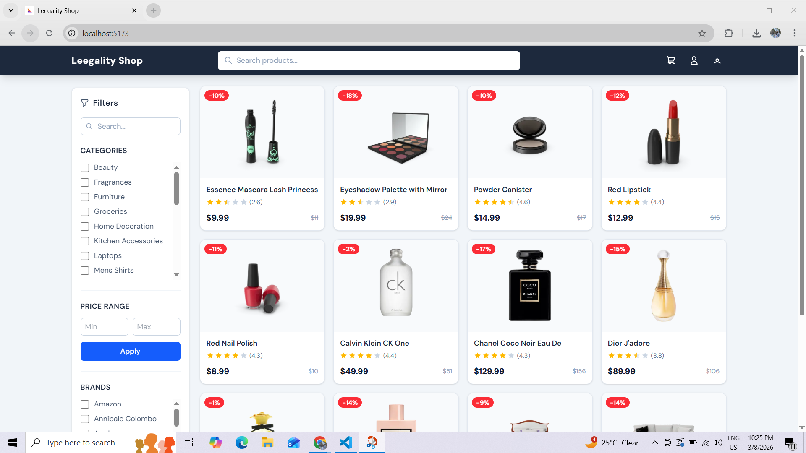
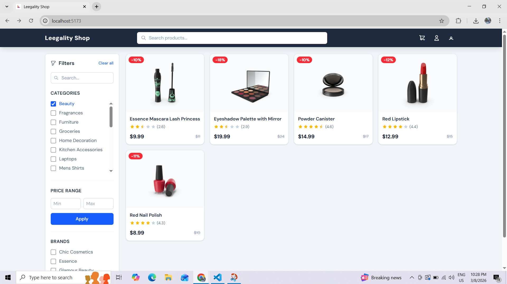
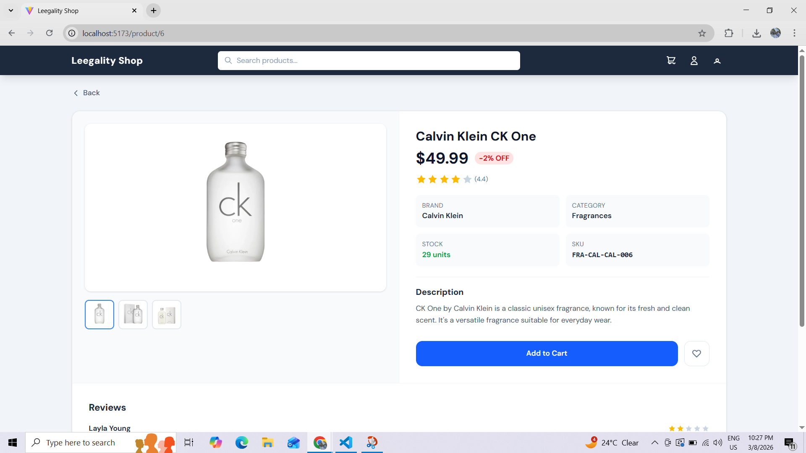
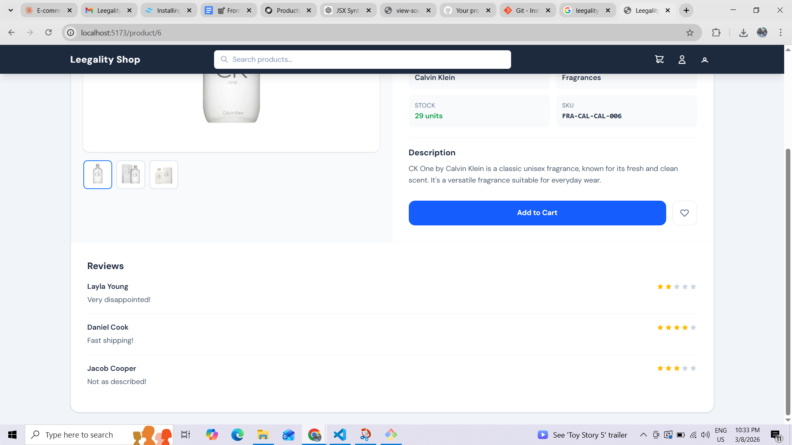

# Leegality Shop

A fully functional e-commerce product listing and detail page built with **React 18**, **Vite**, **Tailwind CSS v4**, and **Axios**.

---

## Setup Instructions

```bash
# Install dependencies
npm install

# Start development server
npm run dev
# → http://localhost:5173

# Build for production
npm run build
```

---

## Architecture

```
src/
├── assets/
|   └── images/
|       └── icons/
|           ├── BackArrowIcon.jsx/       # Back Arrow Icon Used in Pagination and Back for product details  
|           ├── CartIcon.jsx/            # Cart Icon used for Header Cart button
|           ├── EmptyBoxIcon.jsx/        # EmptyBox Icon used in Product Grid when no product found   
|           ├── ErrorIcon.jsx/           # Error Icon used in Product Grid when error came 
|           ├── FilterIcon.jsx/          # Filter Icon used to show filter in filter Panel  
|           ├── ForwardArrowIcon.jsx/    # Forward Arrow Icon Used in Pagination
|           ├── HalfStarIcon.jsx/        # Half Star Icon used in Ratings    
|           ├── HamburgerIcon.jsx/       # Hamburger Icon used for mobile view to show menu or filter 
|           ├── HeatIcon.jsx/            # Heart Icon used in Product Details
|           ├── ProfileIcon.jsx/         # Profile Icon used in Header for which Profile logged in
|           ├── SadFaceIcon.jsx/         # Sad Face Icon used in Not Found Page   
|           ├── SearchIcon.jsx/          # Search Icon used in search fields 
|           ├── StarIcon.jsx/            # Star Icon used in Ratings 
|           └── UserIcon.jsx/            # User Icon used in header
├── components/
│   ├── layout/
|   |   ├── Layout.jsx                    # Main Page which contains Header and Product part
│   │   └── Header.jsx                    # Sticky header with search bar + nav icons
│   ├── filters/
│   │   ├── FilterPanel.jsx               # Composes all filter sub-components
│   │   ├── CategoryFilter.jsx            # Checkbox list from /products/categories API
│   │   ├── PriceFilter.jsx               # Min/Max inputs with Apply button
│   │   └── BrandFilter.jsx               # Extracted unique brands from products
│   ├── product/
│   │   ├── ProductCard.jsx               # Card with image, title, rating, price
│   │   ├── ProductBadge.jsx              # Discount % badge
│   │   ├── ProductGrid.jsx               # Responsive grid + loading/error states
│   │   └── ProductReviews.jsx            # Review list for detail page
│   └── ui/
│       ├── StarRating.jsx                # Reusable star rating display
│       ├── ProductDetailSkeleton.jsx     # Loading indicator for Product detail
|       ├── ProductGridSkeleton.jsx       # Loading indicator for Product grig
│       └── Pagination.jsx                # Page navigation with ellipsis
├── context/
│   └── FiltersContext.jsx                # Global filter state (categories, brands, price, search)
├── hooks/
│   └── useProducts.js                    # Data fetching hooks: useProducts, useProduct, useCategories, useBrands
├── pages/
|   ├── NotFoundPage.jsx                  # Not Found Page for wrong route
│   ├── ProductListingPage.jsx            # Layout: FilterPanel + ProductGrid + Pagination
│   └── ProductDetailPage.jsx             # Full product detail + image gallery + reviews
├── router/
|   └── productRoutes/
|       ├── ProductRouter.jsx/            # Has the router for Product routes
|       └── ProductRoutes.jsx/            # Has the routes of product                   
├── App.jsx                               # Route definitions
└── main.jsx                              # App bootstrap with providers
```

---

## Assumptions

1. **DummyJSON categories API** returns objects `{slug, name, url}` — slugs are used for API calls.
2. **Brands** are extracted client-side since DummyJSON has no dedicated brand endpoint.
3. **Multi-category filtering** is done client-side (DummyJSON only filters by one category at a time via API).
4. **Pagination** uses `limit=12&skip` via the API; client-side price/brand filters apply on top.

---

## Architectural Decisions

| Decision | Rationale |
|---|---|
| **Tailwind CSS v4** | Zero config, `@import "tailwindcss"` in CSS, Vite plugin |
| **FiltersContext** | Single source of truth for all filter state + current page |
| **Component decomposition** | Filters split into 3 sub-components for single responsibility |
| **Axios** | Cleaner error handling and interceptors vs raw fetch |
| **Sticky sidebar** | `sticky top-20` keeps filters visible during scroll |
| **Optimistic UI**  | show skeleton cards while loading
| **Preserve filters on back** | Context lives outside routes — filters survive navigation |

---

## Improvements Given More Time

- **Mobile drawer** for filters (currently hidden on small screens)
- **Debounced search** instead of immediate API call on each keystroke
- **URL sync** — reflect filters in query params so URLs are shareable
- **Base API module** — centralize all API calls in src/api/api.js with an Axios instance (base URL, interceptors, timeout) so hooks only handle state, not URLs


## Screenshots 

- **Product Listing Page**



- **Product Listing Page with Filter**



- **Product Detail Page**





